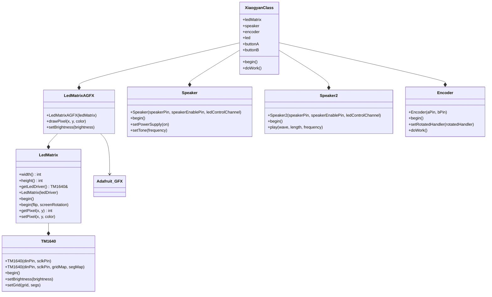

# XIAOGYAN Support Library for Arduino

## Class Diagram

```mermaid
classDiagram

    class XiaogyanClass {
        +ledMatrix
        +speaker
        +encoder
        +led
        +buttonA
        +buttonB
        +begin()
        +doWork()
    }

    XiaogyanClass --* LedMatrixAGFX
    XiaogyanClass --* Speaker
    XiaogyanClass --* Speaker2
    XiaogyanClass --* Encoder

    class TM1640 {
        +TM1640(dinPin, sclkPin)
        +TM1640(dinPin, sclkPin, gridMap, segMap)
        +begin()
        +setBrightness(brightness)
        +setGrid(grid, segs)
    }

    class LedMatrix {
        +width() int
        +height() int
        +getLedDriver() TM1640&

        +LedMatrix(ledDriver)
        +begin()
        +begin(flip, screenRotation)
        +getPixel(x, y) int
        +setPixel(x, y, color)
    }

    class LedMatrixAGFX {
        +LedMatrixAGFX(ledMatrix)
        +drawPixel(x, y, color)
        +setBrightness(brightness)
    }

    LedMatrixAGFX --> Adafruit_GFX
    LedMatrixAGFX --* LedMatrix
    LedMatrix --* TM1640

    class Speaker {
        +Speaker(speakerPin, speakerEnablePin, ledControlChannel)
        +begin()
        +setPowerSupply(on)
        +setTone(frequency)
    }

    class Speaker2 {
        +Speaker2(speakerPin, speakerEnablePin, ledControlChannel)
        +begin()
        +play(wave, length, frequency)
    }

    class Encoder {
        +Encoder(aPin, bPin)
        +begin()
        +setRotatedHandler(rotatedHandler)
        +doWork()
    }

```
